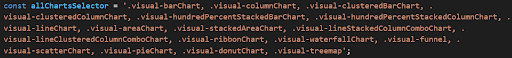
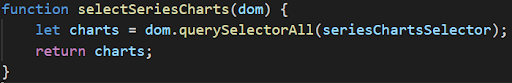
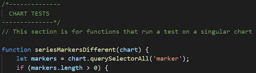
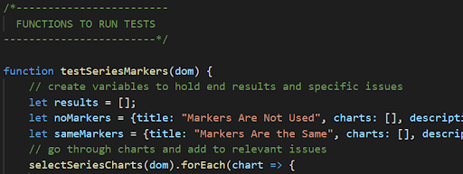
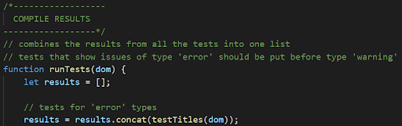

# PowBility - Power BI Accessibility Checker for Visualizations

PowBility is a Chrome extension that, when run, connects to the DOM of the user's Power BI report and returns a list of accessibility issues. It also connects to a Best Practices document that can further the user's understanding and knowledge of creating accessible visualizations for Power BI. It origonated through a capstone project in the Information School at the University of Washington. For more information about the creation of our project, visit our [website](https://drishtividyarthi.wixsite.com/powbility). To download our extension, search [PowBility](https://chrome.google.com/webstore/detail/powbility/bmanlgpbndmocagmlfhnklacianjjbbe) in the Chrome Store.

## Impact
With more than 1 billion people with disabilities worldwide, we believe that accessibility is essential and should not be left as an afterthought. Data visualizations are one area where accessibility lags behind. This is especially important for Power BI, a growing platform with over 5 million subscribers. Power BI creators have difficulties building accessible reports due to a lack of accessibility tools & standard guidelines on how to make visualizations accessible. Thus, we developed PowBility: a Chrome extension that enables Power BI report creators to design accessible visualizations. PowBility aims to enable everyone to utilize visualizations to their full potential. Users can download the PowBility Chrome extension, run the checker, note the highlighted and listed accessibility issues, fix the visualizations based on the recommendations, and re-run the checker to ensure that their visualizations are accessible.

## Solution
### Front-end -- Basic functionality
- The Chrome extension permissions used are “tabs” to gain access to the user’s tab history and  URL match to ensure that the extension is only run on URLs that match `https://app.powerbi.com/*`
When the extension icon is initially clicked, a new window is created for running the checker on the open report from onClicked listener
- A similar listener is applied to the “Run” and “Accessibility Issues” windows where when the “run” or “run again” buttons are clicked, the active window closes and a new window is opened
- When the list of issues is created, the information from the tests is passed on to a chain of functions that add in the correct HTML elements and appropriate listeners for each issue
- Each individual issue shown in the list  is a button element that changes its content based on whether its class attribute contains the “active” tag

### Front-end -- DOM
- In order to get the DOM from the correct tab, the extension finds the most recent active tab that is not the popup and sends a message asking for the DOM
- This returns the DOM in a string format which is converted to a DOM element by adding it as the inner HTML of a template element
- When the DOM is first pulled from the web page, numeric ids are added to each chart in order to make them easily identifiable when connecting each issue to the correct chart
- The tests are then run on that DOM element and stored in a dictionary
- The results of those tests are then appended to the list of issues and sent as a message

### Front-end -- Highlighting
- The message is used to determine which charts should be outlined and with which color depending on if they contain a warning or error
- A separate message is sent in the issue button functionality for each list item
This allows for highlighting of the corresponding chart when a particular issue is selected

### Back-end -- Overview
- The tests rely on a set of constants that will need to be updated if there is ever a change to the class names of the charts or if any charts are added
- These include a set of strings that are formatted as selectors for various sets of charts, as well as two dictionaries that may assist in various tests (one that gives chart names based on the class and another that gives the clustered version of stacked bar/column charts)
- There are also functions for each selector constant that returns a NodeList of applicable charts
- For each test there is a function that runs the test on a singular chart as well as a function that runs that testing function on all the applicable charts and compiles the results in a format that allows for the creation of issues in the UI
- Finally, there is a function that compiles all of the results from all of the tests to be called by ‘check.JS’, which turns that into a list of issues

### Back-end -- Chart Tests
- These are tests that are run on a single chart all return false if the chart does not fail the test, which signals the test compiling functions not to include that chart
- If the chart does fail, it returns the message that will be used in the UI as the issue title

### Back-end -- Functions To Run Tests
- These are tests that run a single test from the ‘CHART TESTS’ section on all the applicable charts and return an array of the issues
- Each element in the array will be a dictionary that includes all of the relevant information for a single issue including:
  - title: the title of the issue that will be displayed in the UI
  - charts: an array that includes a dictionary of all charts that failed the test including:
    - chart: the title of the chart if it has one, otherwise it is left null
    - id_num: the id of the chart that was generated when the extension first ran on the report
  - description: the text that will be shown when an issue is selected in the UI
  - aria: the aria text for the issue in the format 'description of issue Dropdown Information Button'
  - example: 'Series Without Markers Dropdown Information Button'
  - type: the type of issue, either 'error' or 'warning'
  - link: a link to the section of the Best Practices document about this test

### How to make changes
#### Changing constants
- Constants are included in 2 files: ‘chart_constants.js’ and ‘content.js’
- The main constant that may need to be changed is ‘allChartsSelector’ which holds string selector for all of the charts that should be included in the tests
  - If more charts need to be added, this constant will need to be changed in both files

- The constants are string selectors that use the chart class names in the form ‘.visual-chart’ (example: ‘.visual-barChart’)
  - If these class names are changed, they will need to be updated in any applicable constant

#### Adding a test
- If a basic test is added, the only changes needed will be in ‘chart_tests.js’ unless another constant is needed
   - If the test will be run on a subset of the chart types not already included in the file ‘chart_constants.js’, then one will need to be added
   - In ‘chart_tests.js’ in the ‘FUNCTIONS TO RETURN SPECIFIC CHARTS’ section, a function that calls that selector will need to be added

- There are then 3 places that need to be changed:
1. In the section ‘CHART TESTS’, a function will need to be added that runs the required test on a single chart

2. In the section ‘FUNCTIONS TO RUN TESTS’, a function will need to be added that uses the chart selector and the chart test from step 1 to compile the results for that test (see section ‘Back-end -- Functions To Run Tests’ for details or the commented code in the file)

3. Finally, in the section ‘COMPILE RESULTS’, a line will need to be added to the function ‘runTests’ that concatenates the results from the function in step 2 with the rest of the results

